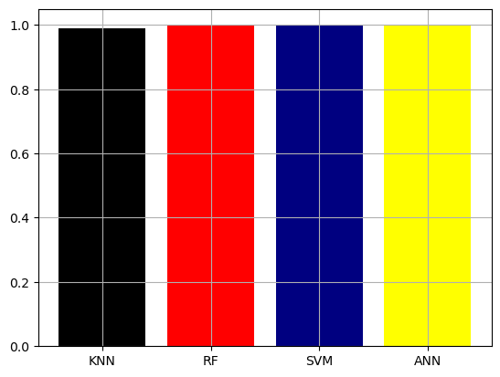
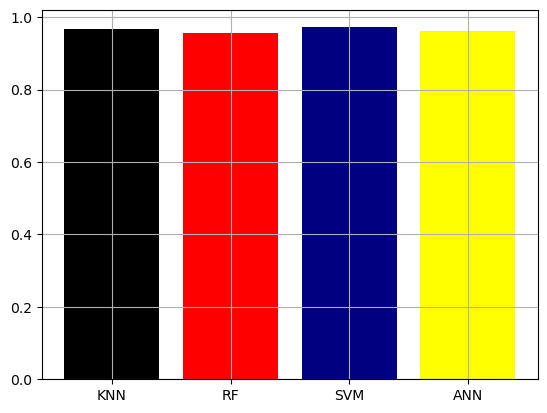
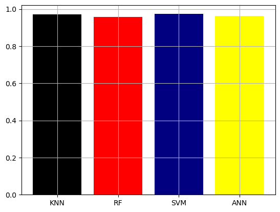

# Handwritten Digit Recognition Project

## Project Overview
This project focuses on recognizing handwritten digits using various machine learning algorithms. The dataset was split into training and test sets, with 30% of the data used for testing.

## Dataset
- **Test Size**: 30% of the dataset (`test_size=0.3`)

## Algorithms Used
The following algorithms were implemented and evaluated:
- K-Nearest Neighbors (KNN)
- Random Forest
- Support Vector Machine (SVM)
- Artificial Neural Network (ANN)

## Evaluation Metrics
The models were evaluated based on the following metrics:
- **Accuracy**: Calculated for both training and test sets.
- **Precision & Recall**: Evaluated on the test set.

## Comparison and Visualization
The performance of the algorithms was compared using the following charts:

1. **Accuracy Score for Training Data**
   
   

2. **Accuracy Score for Test Data**
   
   

3. **Precision for Test Data**
   
   

4. **Recall for Test Data**
   
   

